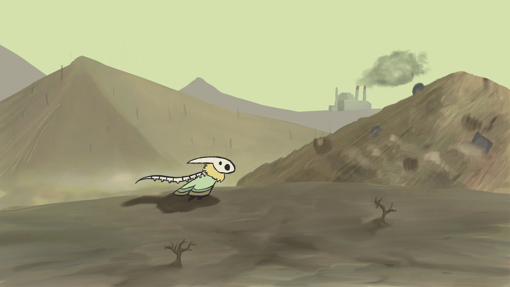

# Re;Mover及び私の成果物について
## Re;Moverについて
『Re;Mover』はチーム『すけーる楽団』がTGS2021に出展したゲームです。主人公である音楽の精を操り世界に調和を取り戻すというゲームで、音楽に力を入れて制作しています。  
ADX2というミドルウェアを用いてインタラクティブミュージックを実現しており、主人公の位置や状態、ギミックの稼働によってBGMが変化します。
## Re;Moverでの私の役割
私はこのゲームにおいてリードプログラマーとして貢献したほか、主人公のキャラクターデザインなども行いました。  

