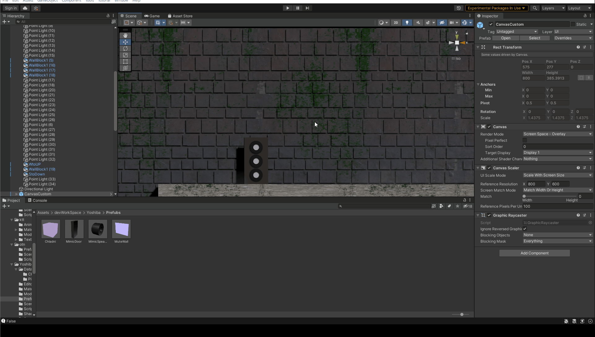

# Re;Mover及び私の成果物について
## Re;Moverについて
『Re;Mover』はチーム『すけーる楽団』がTGS2021に出展したゲームです。主人公である音楽の精を操り世界に調和を取り戻すというゲームで、音楽に力を入れて制作しています。  
Unityで開発しました。ADX2というミドルウェアを用いてインタラクティブサウンドを実現しており、主人公の位置や状態、ギミックの稼働によってBGMが変化します。  
制作人数：11人  
製作期間：約1年  
  
ゲームはここからダウンロードできます。  
http://www.mkmlab.net/TGS/2021/Suke_gaku/index.html
## Re;Moverでの私の役割
### アーティストとして
私はこのゲームにおいてリードプログラマーとして貢献したほか、主人公サウロのキャラクターデザインなども行いました。  

主人公は太古の音の精であり、バランスの崩れた世界の調和(ハーモニー)を取るキャラクターという設定がありました。  
『古代』『音』というキーワードから私が選んだモチーフがパラサウロロフスという恐竜です。パラサウロロフスは独特な形状をした頭蓋骨から頭蓋を笛のようにして鳴いていたと考えられた恐竜で、キーワードを見事に表しています。さらに、恐竜は世界が(隕石などで)バランスを失って絶滅した存在であるため調和をもたらすものとしての必然性も感じられました。  
そこにパラサウロロフスの出土した北アメリカの先住民であるネイティブアメリカンや現在の生きる楽器である鳥のモチーフを取り込み主人公は完成しました。  
名前はパラサウロロフスから取り、サウロです。  
### プログラマーとして 
私の関わった主なスクリプトは/Asset/devWorkSpace/Yoshibaに存在します。これ以外にも他のプログラマーがnamespaceを使えなかった関係でnamespaceが指定されているものには大なり小なり私が関わっています。  
ここではいくつか抜粋して紹介します。  
私がプログラマーとして意識したのは『ユーザ体験』でした。このユーザーとはサウンドアーティストやゲームデザイナーなどの非エンジニアを指します。 
  
#### BGM関連
先述の通り、このゲームにはADX2を用いたインタラクティブサウンドが用いられていますが、その実現のためにはサウンドアーティストがプログラマーと共にコーディングを行う必要があります。この工程は時に10時間以上かかるものでサウンド、プログラマー双方にとって大きな負担となっていました。  
まず最初に調べたのはなぜこんなにも作業時間がかかるのかということです。コーディング作業に同行するとそれはすぐに判明しました。原因は作業に使っていたスクリプトにBGM名やSE名ごとに関数があったり、使う場所ごとに関数があったりといった汎用性のなさです。そのスクリプトはサウンドアーティストが授業で習ったり教科書に載っていた方法を見よう見まねで真似して作り上げたものでした。一般的に考えたらプログラマーが同行している作業でこんなものが使われているというのはあり得ないでしょうが、チーム内で可読性、汎用性を意識したコードデザインの概念があったのは私だけでした。  
これを解決するために作ったのがBGM.csとSE.csです。ADX2ではAisacというパラメーターを元サウンドを変化させていることがヒアリングにより判明したため、BGM.csではAisac値を元にサウンドが変化する基幹関数を作りました。さらによく使う音がプレイヤーの位置や時間、状態で変化するという演出もそれらでAisac値が変化する補助関数を作ることで簡単に扱えるようにしました。  
SE.csではギミックに弾が当たった際、音が鳴る処理を纏めました。これまでは各ギミックで音が鳴る処理が記述されていましたがそれを一元化することで潜在的なバグの危険性を排除し、デバックがし易くなりました。  
他にサウンドに関連した工夫として各ステージのBGMを記述するスクリプトについて挙げられます。ステージのテーマや、レイヤーの位置や経過時間、演出によってBGMが変化する都合上、各ステージにはそれぞれ独自の制御スクリプトが存在します。音に関連するギミックなどはそのスクリプトからBGMインスタンスを取得し、操作を加えます。しかし、各々の制御スクリプトは別々のクラスであるため各ギミックは今いるステージによって参照先を変えなければいけませんでした。そこでまず基底クラスを作成し、それを継承することで同一のインターフェースを介してBGMインスタンスを取得できるようにしました。BGMBehaviourを継承したクラスがそうです。各ステージによって処理は違いながらもBGMインスタンスを取得できるのでギミックはステージの違いを意識せずに操作を加えることが出来ます。  
```cs
using devWorkSpace.SoundTeam.Scripts;
using UnityEngine;
using UnityEngine.Serialization;

namespace devWorkSpace.Yoshiba.Scripts
{
    public class BGMManager : MonoBehaviour
    {
        [SerializeField] private BGMBehaviour bgmControlScript;
        public BGM BGM => bgmControlScript.Bgm;
    }
}
```  
各ステージにはBGMManagerオブジェクトが存在しており、これがステージ毎のBGMBehaviourを継承したコントロールスクリプトを持っており、これによりインスタンスを共通のインターフェースで取得できるのです。  　　
  
#### ゲームデザイナーの為のエディター拡張
プログラマーが作ったギミックはプレハブとしてゲームデザイナーの手で配置されていきます。  
その際に使いやすいように様々な工夫を施しました。  
例えば『音マネドア』というギミックがあります。このギミックでは鍵となる音が2～3個設定され、それによって見た目が変化します。単純に実装した場合、エディター画面上ではどの設定をしたか判別できないため、エディター拡張を行い一目で設定が分かるように工夫しました。
  
このように選択した音の種類によって見た目が変化します。技術力の関係でパラメーターが変更された瞬間反映するというのは実現できていませんが、学習コストと制作期間、効果を天秤にかけ、現状で十分だと判断しました。  
  
#### プログラマーの為のリファクタリング
ギミック制作の効率化といえばSoundWave.csやSoundWaveShooter.csも挙げられます。ReMoverでは主人公や一部ギミックが弾(音波)を発射します。しかし、仕様が定まっていなかった初期に作られたギミックはそれぞれ独自に音波(SoundWave)を処理しており、実装は混迷していました。例えば現在はForkWave.csにまとまっている音叉から発射される音波に関連したスクリプトには**ForkWave.csとSoundWaveOfFork.csの2つ**が同時に存在していました。さらに何の音波が当たったかといった判定や種類ごとの色の変更などはSwitch文で管理されており、それに由来したバグや工程が発生していたのを覚えています。
